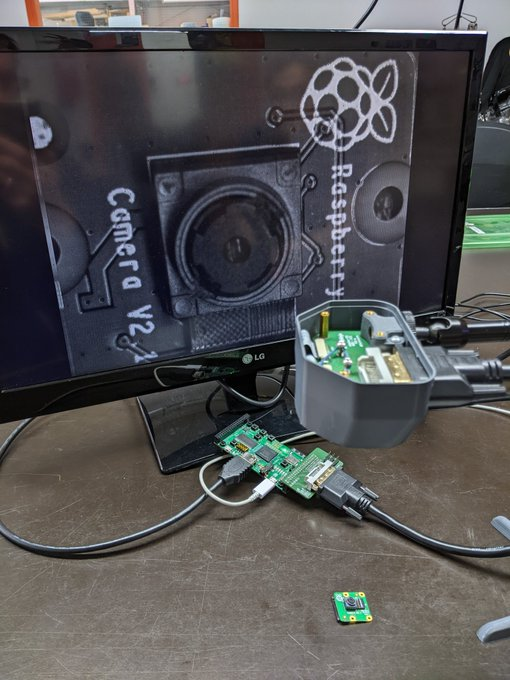

# StereoNinjaFPGA
Experimental FPGA project for streaming two MIPI CSI camera IMX219 streams to an HDMI monitor using a ULX3S FPGA board

Todos

- [x] HDMI Stream 640x480 60FPS
- [x] HDMI Stream 800x600 60 FPS
- [x] HDMI Stream 1280x720 60 FPS
- [ ] HDMI Stream 1920x1080 60FP -not possible
- [x] Initialisation Videostream IMX219 at 916Mbit/s per Lane 
- [x] MIPI SoT Decoding
- [x] MIPI Syncbyte Decoding
- [x] MIPI Header Decoding
- [x] MIPI Protocoll Decoding
- [x] Writing MIPI Videostream in Dualport Ram
- [x] Passthrough IMX219 to HDMI at 640x480 Pixel in greyscale
- [ ] Debayering for Colors
- [ ] Testing IMX219 at other Resolutions 
- [ ] Testing Design with two Cameras
- [ ] Creating Side-by-Side(Half) HDMI 3D Output at 1280x720 

- /DOCS_ULX3S Some Documentations for used Hardware and Protocoll Spezifications
- /ULX3S_ninja PCB for Adapterboard
- /old Some old Projects for Testing
- /src Source Code for StereoninjaFPGA
 
